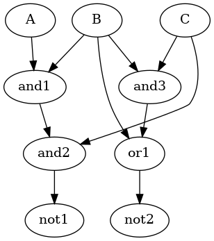
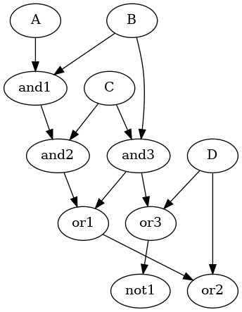
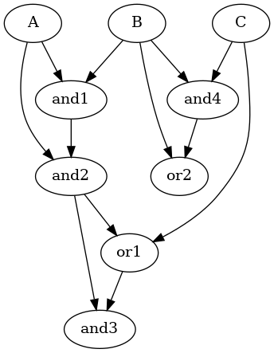

# ML-RCS: Multi-Level Resource-Constrained Scheduling

## Introduction
ML-RCS is a tool designed to perform Multi-Level Resource-Constrained Scheduling for digital circuits represented in BLIF (Berkeley Logic Interchange Format) files. The tool implements two scheduling algorithms:

- **Heuristic Algorithm (`-h` option)**: A list scheduling algorithm that prioritizes operations based on their critical path lengths.
- **Integer Linear Programming (ILP) Algorithm (`-e` option)**: An exact algorithm that formulates the scheduling problem as an ILP model and solves it using the Gurobi optimizer.

This README provides instructions on how to build and run the program, explains the algorithms used, and analyzes discrepancies between the heuristic and ILP results with a test case.

---

## Build Instructions

### Prerequisites
1. **C++11 Compiler**: Ensure you have a C++ compiler that supports the C++11 standard.
2. **Gurobi Optimizer**: Download and install Gurobi Optimizer from [Gurobi's official website](https://www.gurobi.com/).
3. **Gurobi C++ Library**: Ensure the Gurobi C++ library is correctly installed and accessible to your compiler.
4. **BLIF Files**: Have BLIF files ready for testing.

### Compilation
Use the provided `Makefile` to compile the program. Update the paths to Gurobi include and library directories in the `Makefile` if necessary.

```bash
make
```

This command will compile the source files and generate the executable `mlrcs`.

---

## Usage
```bash
./mlrcs [option] [BLIF_FILE] [AND_CONSTRAINT] [OR_CONSTRAINT] [NOT_CONSTRAINT]
```

- **[option]**: `-h` for heuristic scheduling, `-e` for ILP-based scheduling.
- **[BLIF_FILE]**: Path to the BLIF file representing the circuit.
- **[AND_CONSTRAINT]**: Maximum number of AND gates available per time slot.
- **[OR_CONSTRAINT]**: Maximum number of OR gates available per time slot.
- **[NOT_CONSTRAINT]**: Maximum number of NOT gates available per time slot.

### Examples
#### Heuristic Scheduling:
```bash
./mlrcs -h sample.blif 2 1 1
```

#### ILP-based Scheduling:
```bash
./mlrcs -e sample.blif 2 1 1
```

---

## Algorithms Explanation

### Heuristic Algorithm (`-h`)
The heuristic algorithm implements a list scheduling approach:
1. **Compute Node Priorities**: Calculate the longest path from each node to the output nodes (critical path length). Nodes with higher critical path lengths have higher priority.
2. **Schedule Nodes**: At each time step, schedule ready nodes (whose predecessors have been scheduled) based on their priorities and resource constraints.
3. **Repeat**: Continue scheduling until all nodes are scheduled.

This algorithm aims to minimize the latency but may not always find the optimal solution due to its greedy nature.

### ILP Algorithm (`-e`)
The ILP algorithm formulates the scheduling problem as an Integer Linear Programming model:
1. **Variables**: Define binary variables `x[i][t]` indicating whether operation `i` is scheduled at time `t`.
2. **Constraints**:
   - **Unique Scheduling**: Each operation must be scheduled exactly once.
   - **Dependency**: An operation cannot start until all its predecessors have completed.
   - **Resource Limits**: The number of operations of each type scheduled at the same time cannot exceed the resource limits.
3. **Objective Function**: Minimize the overall latency (maximum completion time of all operations).
4. **Solve**: Use the Gurobi optimizer to find the optimal scheduling that satisfies all constraints.

The ILP algorithm guarantees to find the optimal solution but may be computationally intensive for large circuits.

---

## Discrepancy Analysis Between Heuristic and ILP Results

### Test Case Demonstration
We have prepared a test case `discrepancy.blif` where the heuristic and ILP algorithms produce different latencies.

#### BLIF File (`discrepancy.blif`)
```blif
.model discrepancy
.inputs A B C
.outputs not1 not2
.names A B and1
11 1
.names and1 C and2
11 1
.names B C and3
11 1
.names and2 not1
0 1
.names B and3 or1
1- 1
-1 1
.names or1 not2
0 1
.end
```
This BLIF file represents a simple circuit with dependencies that can lead to different scheduling outcomes.

---
### Circuit Diagram


---

### Running the Heuristic Algorithm
```bash
./mlrcs -h discrepancy.blif 1 1 1
```

**Output:**
```
Heuristic Scheduling Result
1: {and1} {} {}
2: {and3} {} {}
3: {and2} {or1} {}
4: {} {} {not1}
5: {} {} {not2}
LATENCY: 5
END
```

---

### Running the ILP Algorithm
```bash
./mlrcs -e discrepancy.blif 1 1 1
```

**Output:**
```
ILP-based Scheduling Result
1: {and3} {} {}
2: {and1} {or1} {}
3: {and2} {} {not2}
4: {} {} {not1}
LATENCY: 4
END
```

---

### Observations and Analysis
- **Heuristic Latency**: 5 time units.
- **ILP Latency**: 4 time units.

---
### Why the Difference Occurs
1. **Resource Constraints**:  
   - The heuristic algorithm prioritizes operations based on critical path lengths without considering resource constraints.
   - In this case, the heuristic algorithm schedules `and1` before `and3`, leading to a longer latency.

2. **ILP Optimization**:
    - The ILP algorithm formulates the scheduling problem with resource constraints, ensuring optimal scheduling.
    - It schedules `and3` before `and1` to minimize the overall latency.

3. **Dependency Resolution**:
    - The ILP algorithm considers the dependencies between operations to minimize the overall latency.
    - The heuristic algorithm may not always resolve dependencies optimally, leading to suboptimal scheduling.

---

## Heuristic Algorithms: Strengths and Weaknesses
### Key Features of List Scheduling (ML-RCS)
List Scheduling algorithms prioritize scheduling **ready components** (those with all dependencies resolved) as early as possible. However, this approach suffers from a fundamental limitation: **the inability to predict future resource conflicts**.

### Critical Limitation: "Cannot Predict the Future"
1. **Lack of Global Awareness**:  
   - Decisions are based solely on the current state (ready components), without considering the downstream effects of resource allocation.
   - This often leads to suboptimal scheduling when resource constraints create conflicts.

2. **Resource "Congestion" Phenomenon**:  
   - When one component requires the maximum available resources, other components might remain idle due to dependencies, even if resources are available for their execution.
   - This results in underutilized resources and decreased parallelism.

#### Example:
- **Scenario**: Component A needs 2 resource units, Component B needs 1.  
- **Resources Available**: Only 2 units.  
- **Outcome**: If A is prioritized, B has to wait until A completes, even if B could have been executed earlier under different scheduling.

3. **Scaling Challenges**:  
   - Heuristic methods like **Hu’s Algorithm** are effective for small circuits and specific use cases, such as minimizing the critical path.
   - However, for large circuits with complex dependencies, it becomes increasingly difficult to determine the optimal scheduling at each step to maximize resource utilization.

### Trade-offs in Heuristic Scheduling
- **Advantages**:
  - Fast execution, suitable for real-time scenarios.
  - Provides a feasible solution close to optimal, which can act as an **upper bound** for further refinement.
- **Disadvantages**:
  - Only focuses on local optimizations.
  - Struggles with complex circuits and strict resource constraints.

---

## ILP-Based Scheduling: Optimal Yet Resource-Intensive

### Overview of ILP (Integer Linear Programming)
ILP formulates the scheduling problem using mathematical functions to optimize an **objective function** under specific **resource constraints**. It is capable of finding the **global optimal solution**.

### Advantages of ILP
1. **Optimal Solutions**:
   - Guarantees the best possible schedule within the given constraints.
   - Considers all potential solutions, ensuring no resource conflicts.
2. **Multiple Optimal Solutions**:
   - For the same scheduling problem, multiple solutions might satisfy the constraints, offering flexibility in implementation.
3. **Effective for Resource-Limited Environments**:
   - ILP ensures efficient use of limited resources, avoiding the "congestion" phenomenon.

### Limitations of ILP
1. **High Computational Cost**:
   - Solving large-scale problems with many constraints can take an impractical amount of time.
2. **Memory Constraints**:
   - Tools like Gurobi or other ILP solvers can experience memory overflow when handling highly complex problems.
3. **Not Suitable for Real-Time Applications**:
   - The time required for computation makes ILP infeasible for scenarios demanding immediate results.

---

## Comparing Heuristic and ILP Approaches

| Feature                    | Heuristic Algorithm         | ILP-Based Scheduling           |
|----------------------------|-----------------------------|---------------------------------|
| **Execution Speed**        | Fast, suitable for real-time | Slow, not suitable for real-time |
| **Solution Quality**       | Near-optimal, depends on design | Guarantees global optimal solutions |
| **Scalability**            | Handles large circuits but struggles with resource constraints | Solves small to medium circuits; scales poorly with complexity |
| **Resource Utilization**   | Cannot guarantee efficiency | Maximizes resource utilization |

---

### Test Case Demonstration 2
We have prepared another test case `discrepancy2.blif` where the heuristic and ILP algorithms produce different latencies.

#### BLIF File (`discrepancy2.blif`)
```blif
.model discrepancy2
.inputs A B C D
.outputs or2 not1
.names A B and1
11 1
.names and1 C and2
11 1
.names B C and3
11 1
.names and2 and3 or1
1- 1
-1 1
.names or1 D or2
1- 1
-1 1
.names and3 D or3
1- 1
-1 1
.names or3  not1
0 1
.end
```
This BLIF file represents a simple circuit with dependencies that can lead to different scheduling outcomes.

---
### Circuit Diagram


---

### Running the Heuristic Algorithm
```bash
Heuristic Scheduling Result
1: {and1} {} {}
2: {and2} {} {}
3: {and3} {} {}
4: {} {or1} {}
5: {} {or3} {}
6: {} {or2} {not1}
LATENCY: 6
END
```
---

### Running the ILP Algorithm
```bash
ILP-based Scheduling Result
1: {and3} {} {}
2: {and1} {} {}
3: {and2} {or3} {}
4: {} {or1} {}
5: {} {or2} {not1}
LATENCY: 5
END
```
---

### Observations and Analysis
- **Heuristic Latency**: 6 time units.
- **ILP Latency**: 5 time units.

---

### Why the Difference Occurs
This is another typical example of resource congestion. Although the longest path appears to be 4 cycles, due to limited resources, a minimum of 5 cycles is required. However, prioritizing the longest path results in an additional cycle cost.

---

### Test Case Demonstration 3
We have prepared another test case `same_latency.blif` where the heuristic and ILP algorithms produce the same latencies.

#### BLIF File (`same_latency.blif`)
```blif
.model same_latency
.inputs A B C
.outputs or1 or2
.names A B and1
11 1
.names and1 A and2
11 1
.names and2 C or1
1- 1
-1 1
.names and2 or1 and3
11 1
.names B C and4
11 1
.names B and4 or2
1- 1
-1 1
.end
```
---
### Circuit Diagram


---

### Running the Heuristic Algorithm
```bash
Heuristic Scheduling Result
1: {and1} {} {}
2: {and2} {} {}
3: {and4} {or1} {}
4: {and3} {or2} {}
LATENCY: 4
END
```
---

### Running the ILP Algorithm
```bash
ILP-based Scheduling Result
1: {and1} {} {}
2: {and2} {} {}
3: {and4} {or1} {}
4: {and3} {or2} {}
LATENCY: 4
END
```
---

### Observations and Analysis
- **Heuristic Latency**: 4 time units.
- **ILP Latency**: 4 time units.

---

### Why the Results Match
In this case, both the heuristic and ILP algorithms produce the same latency because the circuit's structure and resource constraints allow for an optimal schedule that can be easily identified by both methods. The dependencies and resource availability align in such a way that the heuristic's greedy approach coincides with the ILP's optimal solution.

---

## Conclusion
In this project, we explored the strengths and weaknesses of heuristic and ILP-based scheduling algorithms for digital circuits. The heuristic algorithm, while fast and suitable for real-time applications, may not always produce optimal results due to its greedy nature. On the other hand, the ILP-based algorithm guarantees optimal solutions but can be computationally intensive and impractical for large circuits.

Through various test cases, we demonstrated how these algorithms perform under different scenarios and resource constraints. The discrepancy analysis highlighted the importance of considering resource constraints and dependencies to achieve efficient scheduling.

Overall, this project provided valuable insights into the trade-offs between heuristic and ILP-based scheduling approaches, emphasizing the need for careful algorithm selection based on the specific requirements and constraints of the scheduling problem at hand.

---
## References
- [Gurobi Optimizer](https://www.gurobi.com/)
- [BLIF Format Specification](https://course.ece.cmu.edu/~ee760/760docs/blif.pdf)

---

## Acknowledgments
This project utilizes the Gurobi Optimizer for solving ILP problems and is intended for educational purposes to demonstrate scheduling algorithms in resource-constrained environments.

---
## Contributors
- [Shiina](https://github.com/space789)

---
## License
This project is licensed under the MIT License